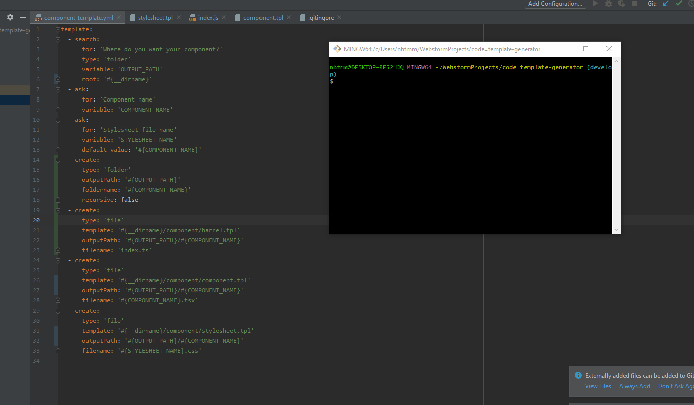

# Code template generator



Create a flow to generate redundant code and save time.

## Summary

Using a YAML configuration file and template files you are able to create any piece of code. [Example](./component)

## Flow - Actions

Action configurtion params can access previous variable using `#{VAR_NAME_HERE}`

You can access the process execution path using : `#{__dirname}`

### AskAction

Action to ask a question and store its answer inside a variable.

```yaml
- ask:
    for: 'your phrase/question ?'
    variable: 'YOUR_VAR_NAME'
    default_value: null
```

### CreateAction

Action to perform file/folder creation.

#### type - folder

```yaml
- create:
    type: 'folder'
    outputPath: '#{OUTPUT_PATH}'
    foldername: '#{COMPONENT_NAME}'
    recursive: false
```

#### type - file

Template params is optional. If no template file is provided the output file will be empty.

Template file example:
```
here is my template file #{ACCESS_MY_NAME_VAR_HERE}

const #{COMPONENT_NAME} = () => {}

function <#{FUNCTION_TYPES}>(#{FUNCTION_ARG_1}, #{FUNCTION_ARG_2}) {
   //
}

even simple text works #{MY_VAR}
```

```yaml
- create:
    type: 'file'
    template: '#{__dirname}/component/barrel.tpl'
    outputPath: '#{OUTPUT_PATH}/#{COMPONENT_NAME}'
    filename: 'index.ts'
```
### SearchAction

Action to perform a search on disk and assign the result in a variable.

```yaml
- search:
    for: 'your phrase/question here'
    type: 'folder' # currently the only type supported (later: file)
    variable: 'FOLDER_FOUND'
    root: '#{__dirname}' # current process execution path
```

## Flow - YAML Configuration

```yaml
template:
  # actions here
  - ask:
    # config var here
  - search:
    # config var here
  - create:
    # config var here
```


